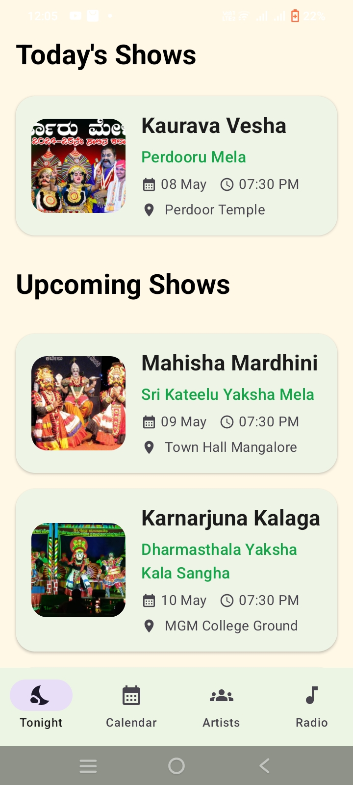
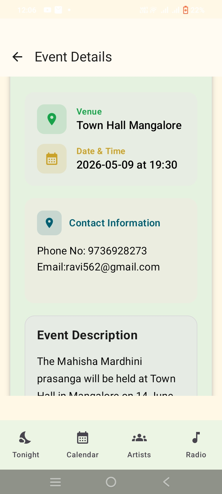
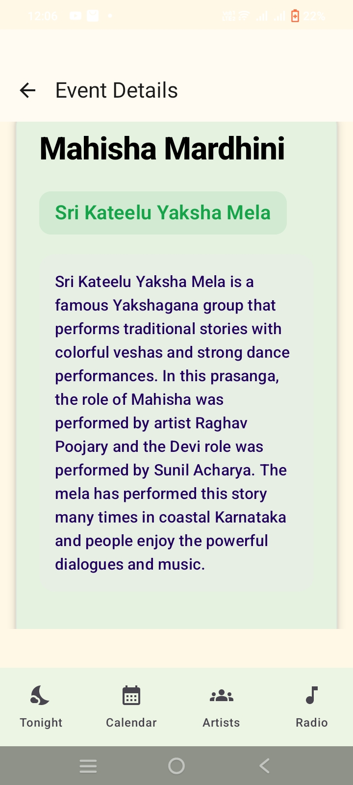
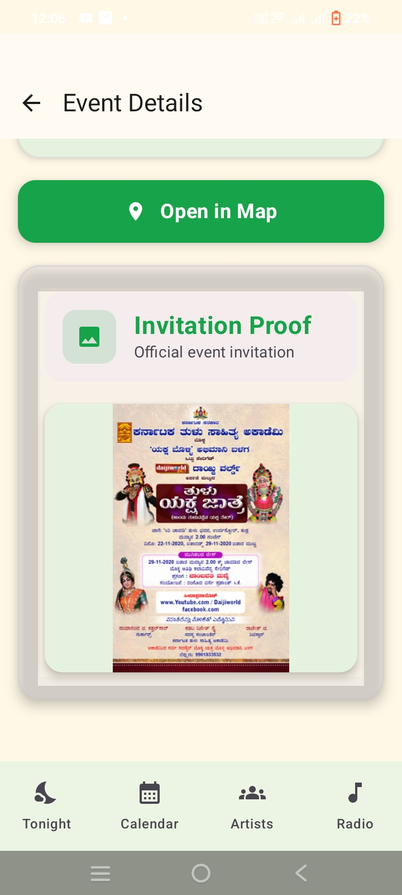
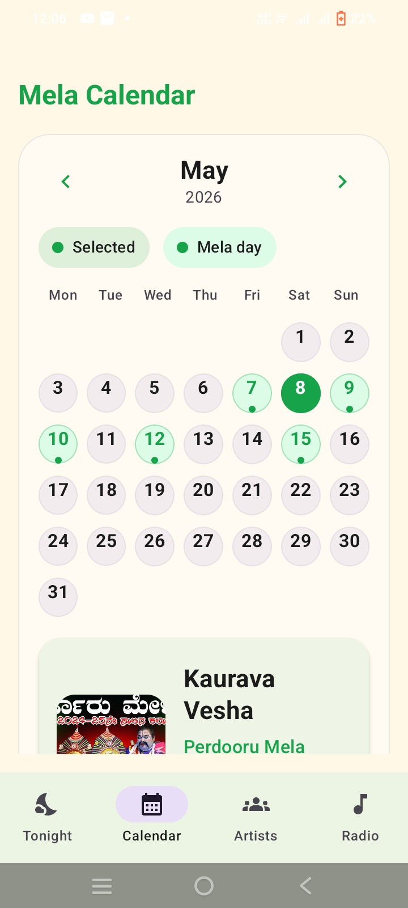
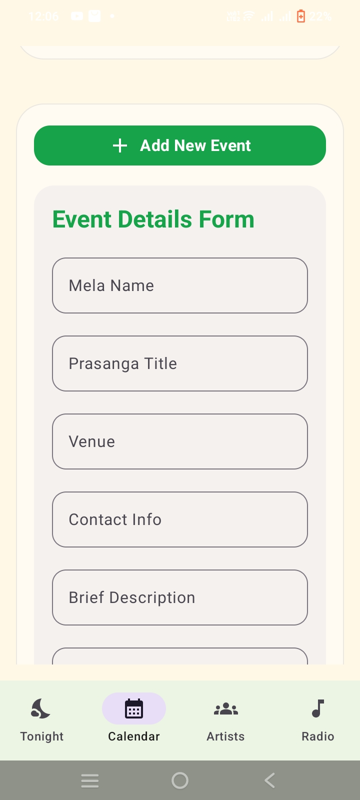
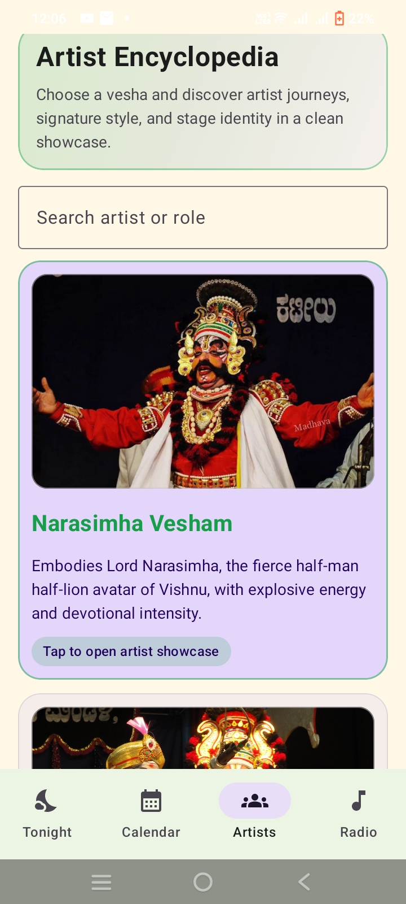
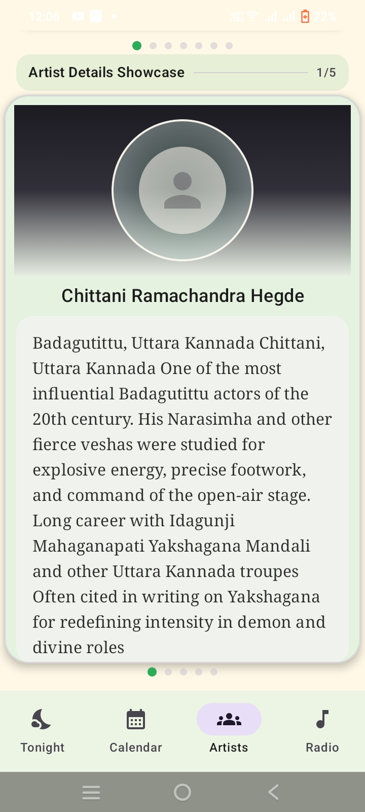
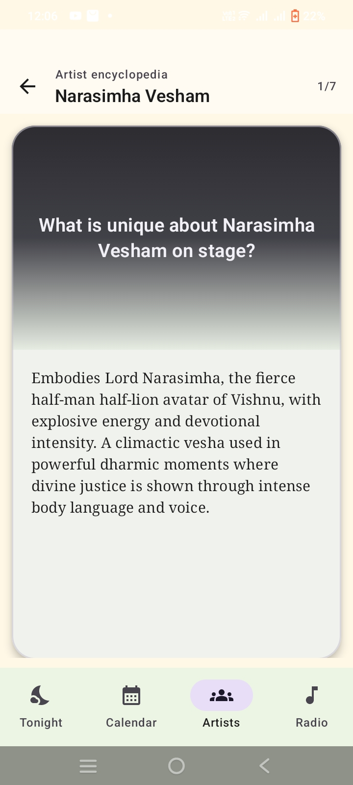
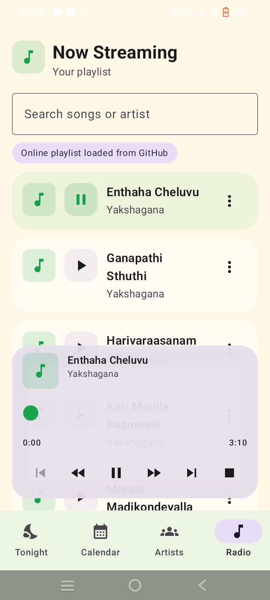

# Yakshagana-Loka (Android App)

[](https://kotlinlang.org/)
[]()
[]()

Welcome to **Yakshagana-Loka**, a modern Android application designed to digitally preserve and promote the traditional art form of Yakshagana. The application acts as a “Digital Stage” where users can explore live mela schedules, discover legendary artists and veshas, listen to Yakshagana audio tracks, and view detailed event information in a clean and user-friendly interface.

---

# 📑 Table of Contents

- [🎭 Problem Statement](#-problem-statement)
- [🌟 Vision](#-vision)
- [🚀 Features](#-features)
- [📱 Application Flow](#-application-flow)
- [🧠 Concepts Covered](#-concepts-covered)
- [📂 Project Structure](#-project-structure)
- [📷 Screenshots](#-screenshots)
- [📦 Technologies Used](#-technologies-used)
- [💻 Getting Started](#-getting-started)
- [🎯 Impact Goals](#-impact-goals)
- [✅ Success Criteria Implemented](#-success-criteria-implemented)
- [📄 License](#-license)
- [📬 Contact](#-contact)

---

# 🎭 Problem Statement

Yakshagana is one of Karnataka’s most vibrant traditional art forms, but many Yakshagana Melas struggle to effectively share their tour schedules and performance information with audiences. Most updates are limited to posters, local announcements, or word-of-mouth communication, causing fans to miss performances and cultural events.

---

# 🌟 Vision

Yakshagana-Loka is designed as a “Digital Stage” for Yakshagana enthusiasts, artists, and cultural communities. The application provides a centralized platform where users can discover live mela schedules, explore artist profiles, understand veshas and prasangas, and experience Yakshagana music and traditions through an interactive mobile experience.

The goal of the project is to digitally preserve and modernize access to Yakshagana while maintaining the traditional artistic essence of the culture.

---

# 🚀 Features

✅ Tonight’s live mela schedule  
✅ Upcoming Yakshagana events list  
✅ Interactive mela calendar view  
✅ Detailed event information screen  
✅ Event venue and contact information  
✅ Open venue directly in Google Maps  
✅ Invitation proof / official event poster section  
✅ Artist Encyclopedia with vesha showcase  
✅ Detailed artist profile pages  
✅ Yakshagana prasanga descriptions  
✅ Talamaddale / Yakshagana radio section  
✅ Audio playback controls for songs and dialogues  
✅ Song download option  
✅ Search functionality for artists and songs  
✅ Manager event form for adding mela details  
✅ Traditional Yakshagana inspired UI theme  
✅ Responsive Jetpack Compose based interface  

---

# 📱 Application Flow

## 🌙 Tonight Shows

Users can explore Yakshagana performances happening today with complete details including mela name, venue, date, and time.

## 📅 Mela Calendar

The calendar section displays mela schedules in a monthly view and highlights active event days for easy tracking.

## 🎭 Artist Encyclopedia

Users can browse different veshas and learn about legendary Yakshagana artists, performance styles, and stage identities.

## 📻 Yakshagana Radio

A dedicated radio section provides Yakshagana songs and dialogue clips with playback controls and music management features.

## 📍 Event Navigation

Users can directly open mela locations using integrated map redirection support.

## 📝 Event Management

Managers can add and organize mela details using a dedicated event details form.

---

# 🧠 Concepts Covered

This project demonstrates practical Android development concepts including:

- Jetpack Compose UI Design
- Kotlin-based Android Development
- Material Design Components
- Navigation and Screen Management
- Calendar Integration
- Media Playback Features
- Dynamic Event Rendering
- Search and Filtering
- Form Handling
- Modern Android Architecture
- State Management
- Traditional UI Theming

---

# 📂 Project Structure

```text
Yakshagana-Loka/
│
├── app/
│   ├── ui/
│   ├── screens/
│   ├── components/
│   ├── data/
│   ├── navigation/
│   └── assets/
│
├── gradle/
├── README.md
├── build.gradle.kts
├── settings.gradle.kts
└── gradle.properties
```

---

# 📷 Screenshots

## 🌙 Tonight Shows

Displays today’s and upcoming Yakshagana performances with mela information, venue, timing, and event posters.

<p align="center">
  
</p>

---

## 🎭 Event Details

Detailed event information including mela description, prasanga details, venue, date & time, and contact information.

<p align="center">
  
  
</p>

## 🪧 Invitation Proof

Official Yakshagana invitation posters and proof section attached to each event.

<p align="center">
  
</p>

---

## 📅 Mela Calendar

Interactive mela calendar with highlighted performance dates and monthly schedule tracking.

<p align="center">
  
</p>

---

## ➕ Event Management Form

Manager interface used to add mela details, venue information, contact details, and event descriptions.

<p align="center">
  
</p>

---

## 🎨 Artist Encyclopedia

Dedicated artist encyclopedia section showcasing veshas, performance styles, and role-based search functionality.

<p align="center">
  
</p>

---

## 👤 Artist Showcase

Detailed artist showcase pages explaining vesha importance, artist history, and performance uniqueness.

<p align="center">
  
  
</p>

---

## 📻 Yakshagana Radio

Audio streaming interface containing Yakshagana songs, devotional tracks, and dialogue collections with playback controls.

<p align="center">
  
</p>

---

# 📦 Technologies Used

| Technology | Description |
|------------|-------------|
| Kotlin | Main Android development language |
| Jetpack Compose | Modern UI toolkit |
| Android Studio | Development environment |
| Material Design | UI styling and components |
| ExoPlayer | Audio playback management |
| Google Maps Integration | Event navigation support |

---

# 💻 Getting Started

## 🔧 Prerequisites

- Android Studio
- Android SDK
- Kotlin Support
- Android Device or Emulator

---

# 🚀 Installation

## Clone the repository

```bash
git clone https://github.com/SurajKulal1/Yakshagana-Loka-App.git
```

## Open the project

```bash
Open project in Android Studio
```

## Build and Run

```bash
Sync Gradle and run the application on emulator or Android device
```

---

# 🎯 Impact Goals

## 🎭 Digital Preservation

Preserving Yakshagana culture and making traditional knowledge accessible to younger generations.

## 📈 Artistic Reach

Helping Yakshagana Melas reach wider audiences through digital visibility.

## 🌍 Global Accessibility

Providing a platform for Kannada communities and Yakshagana fans worldwide.

---

# ✅ Success Criteria Implemented

✅ Dynamic “Tonight’s Shows” section  
✅ Artist profile and vesha showcase  
✅ Traditional Yakshagana inspired UI design  
✅ Interactive mela calendar  
✅ Audio playback functionality  
✅ Event navigation support  
✅ Event invitation proof display  
✅ Artist encyclopedia section  
✅ Event management form  

---

# 📄 License

This project is developed for educational and internship purposes.

---

# 📬 Contact

**Suraj Kulal**  
GitHub: https://github.com/SurajKulal1

---

> ⭐ Support and preserve traditional art through technology with Yakshagana-Loka!
